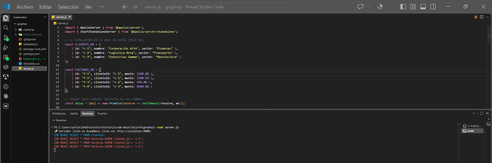
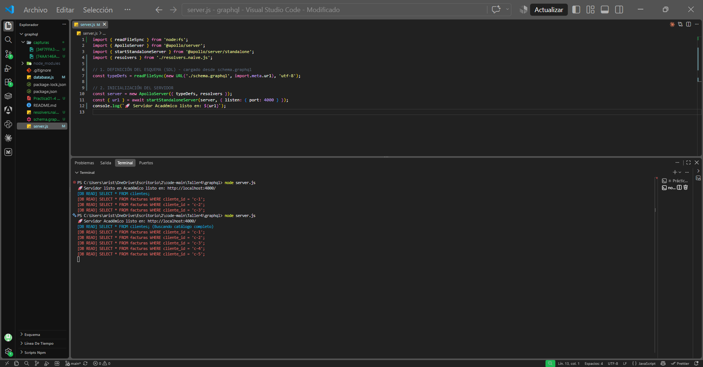
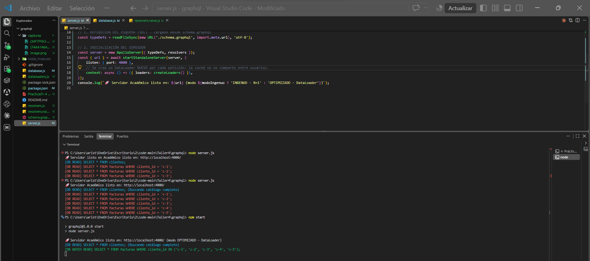

# Reporte – Práctica 04: GraphQL y DataLoader

**Asignatura:** Patrones de Diseño de APIs · **Maestría de Software** · UPS

## Resultado

| Escenario | Consultas a la BD por petición |
|---|---|
| Solución ingenua (`resolvers.naive.js`) | **6** → 1 de clientes + 5 de facturas (N+1) |
| Solución con DataLoader (`resolvers.js`) | **2** → 1 de clientes + 1 en lote de facturas |

**Número exacto de consultas impresas tras aplicar DataLoader: 2.**

---

## 1. El problema

El tablero necesita cada cliente con sus facturas. Con REST esto cuesta 1 petición para `/clientes` y N peticiones para `/clientes/{id}/facturas` (**under-fetching**).

GraphQL lo reduce a **una sola petición HTTP**:

```graphql
query GetDashboardData {
  clientes { nombre sector facturas { monto estado } }
}
```

Pero el problema pasa al servidor. GraphQL ejecuta el resolver `Cliente.facturas` **una vez por cada cliente**, y cada ejecución consulta la BD por su cuenta:

```js
facturas: async (parent) => await db.fetchFacturasByClienteId(parent.id)
```

Así, la petición termina en **1 + N consultas**. Ese es el **problema N+1**. Con 5 clientes son 6 consultas; con 1.000 clientes serían 1.001.

**Antes (código base, 3 clientes → 4 consultas):**



**Antes (resolvers ingenuos con `database.js`, 5 clientes → 6 consultas):**



---

## 2. La solución: DataLoader

DataLoader se ubica entre los resolvers y la BD y hace dos cosas:

1. **Agrupar (batching):** `.load(id)` no consulta la BD. Solo anota el ID. Al terminar el tick actual del event loop, junta todos los IDs anotados y llama **una sola vez** a la función por lotes.
2. **Guardar en caché por petición:** si el mismo ID se pide dos veces dentro de la misma petición, se consulta una sola vez.

Una forma simple de verlo: un mesero que toma los pedidos de todas las mesas y va **una sola vez** a la cocina, en lugar de ir una vez por cada mesa.

### Qué se implementó

**a) Función por lotes, en `dataloaders.js`.**

```js
const batchFacturasPorCliente = async (clienteIds) =>
    await db.fetchFacturasByClienteIdsBatch(clienteIds);   // WHERE cliente_id IN (...)

export const createLoaders = () => ({
    facturasPorCliente: new DataLoader(batchFacturasPorCliente),
});
```

La función devuelve **un resultado por cada ID, en el mismo orden** en que llegaron. Es el contrato de DataLoader. El cliente `c-5` no tiene facturas y recibe `[]`.

**b) Resolver optimizado, en `resolvers.js`.**

```js
facturas: (parent, _args, { loaders }) => loaders.facturasPorCliente.load(parent.id)
```

**c) Un loader por petición, en `server.js`.**

```js
context: async () => ({ loaders: createLoaders() }),
```

Se crea un loader nuevo en cada petición para que la caché **no se comparta entre usuarios**. Un loader global podría devolver datos de un usuario a otro (fuga de información) y mostrar datos viejos. Se verificó que dos peticiones seguidas ejecutan cada una su propia consulta en lote.

**Después (DataLoader → 2 consultas):**



---

## 3. Análisis

- **Consultas:** pasan de `N + 1` a **2 constantes**, sin importar cuántos clientes haya.
- **Tiempo de respuesta:** en esta simulación las dos versiones tardan unos **0,42 s**. Apollo ejecuta en paralelo los resolvers de una lista, así que las esperas de 200 ms de las consultas ingenuas se solapan. La mejora real es la **carga sobre la BD**: menos conexiones, CPU y viajes de red, que es lo que limita la escalabilidad con muchos usuarios a la vez.
- **Robustez:** un cliente sin facturas (`c-5`) devuelve `[]` y no produce errores.

## 4. Conclusión

GraphQL resolvió el problema del **cliente**: muchas peticiones HTTP pasaron a ser una sola. DataLoader resolvió el problema del **servidor**: N consultas a la BD pasaron a ser una por lote. Crear el loader por petición mantiene la caché aislada entre usuarios.
